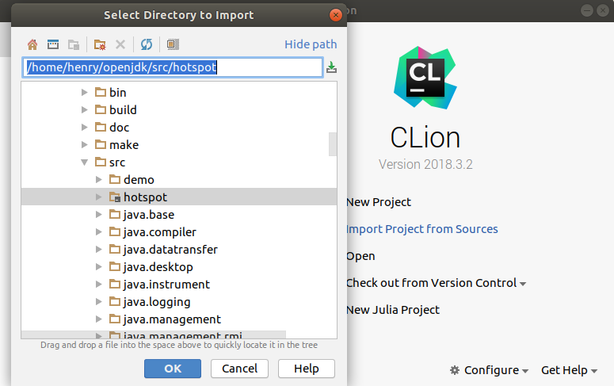
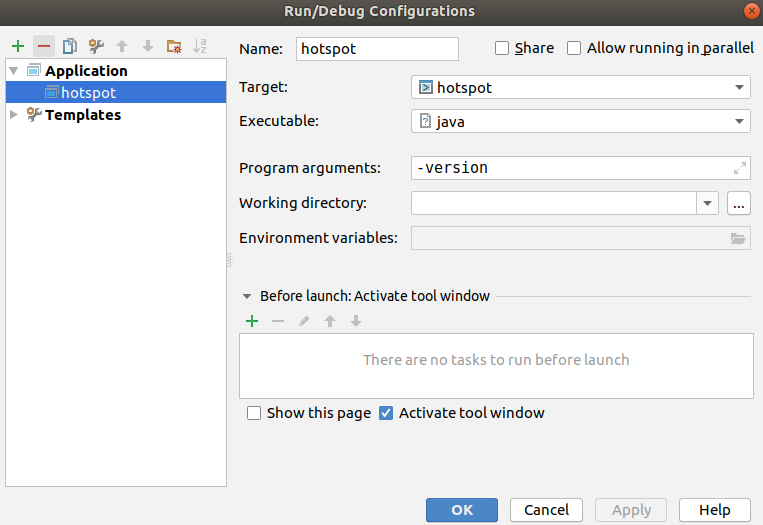
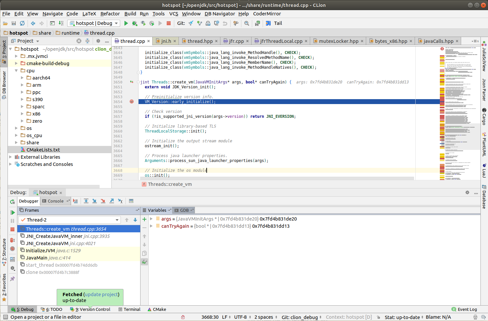

# How to debug Java Virtual Machine in Clion

- make sure you are using latest version java

```
11:46 $ java -version
java version "11.0.1" 2018-10-16 LTS
Java(TM) SE Runtime Environment 18.9 (build 11.0.1+13-LTS)
Java HotSpot(TM) 64-Bit Server VM 18.9 (build 11.0.1+13-LTS, mixed mode)
```

- install dependencies

```
sudo apt-get install libx11-dev libxext-dev libxrender-dev \
  libxrandr-dev libxtst-dev libxt-dev libcups2-dev \
  libfontconfig1-dev libasound2-dev ccache -y
```

- download jdk source and compile

```
git clone -b clion_debug https://github.com/henrywoo/openjdk
cd openjdk
./configure --with-debug-level=slowdebug --enable-dtrace \
    --with-jvm-variants=server --with-target-bits=64 \
    --enable-ccache --with-num-cores=8 --with-memory-size=8000  \
    --disable-warnings-as-errors
make JOBS=8
```

- open Clion and import source code



- edit debug configuration



- set breakpoint and debug



All updates about this article are available from: [here](https://github.com/henrywoo/debug_JVM_Clion)

